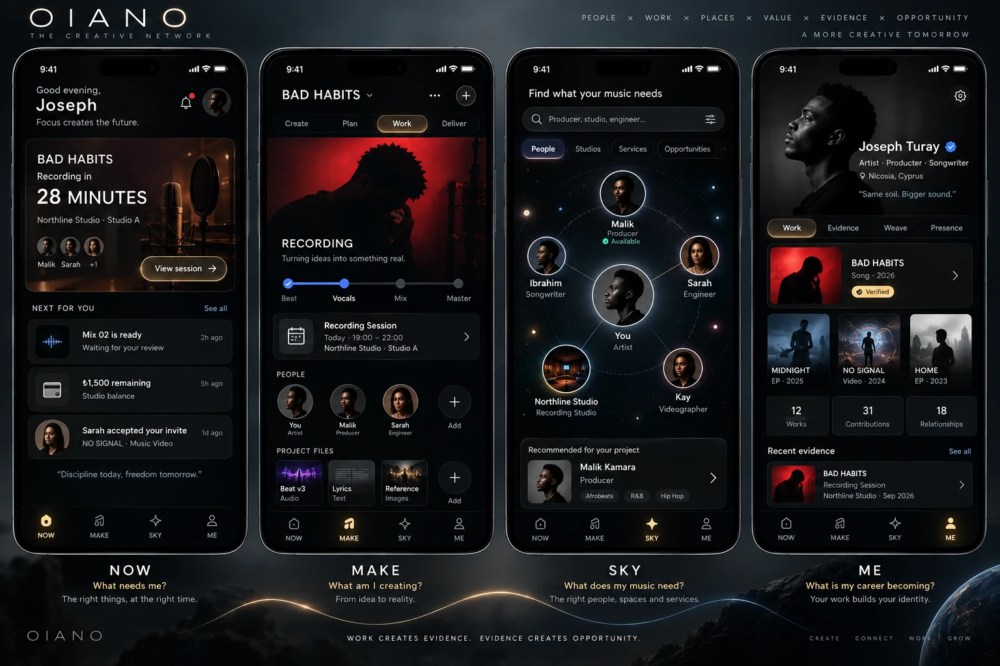

# OIANO — where the experience is heading

The owner's picture of the finished product, shared on 2026-10-07: four surfaces over one
network of people, work, places, value, evidence and opportunity. "Work creates evidence.
Evidence creates opportunity."

This is a **target, not a screen to build now.** Each surface is a projection over the
canonical core and arrives with its migration step
([`OIANO_BUILD_DIRECTION.md`](../OIANO_BUILD_DIRECTION.md)). Until then today's screens keep
their names; putting NOW, MAKE, SKY or ME on a legacy screen presents a mechanism that does not
exist yet ([`OIANO_FROZEN_ARCHITECTURE.md`](../OIANO_FROZEN_ARCHITECTURE.md), law 16).

## What each surface shows, and what must be true first

| Surface | Question it answers | What it shows | Needs, in the frozen order |
|---|---|---|---|
| **NOW** | What needs me? | The live session on a Work ("BAD HABITS, recording in 28 minutes, Northline Studio, Studio A") with the people in it; "Next for you": a version awaiting review, a balance owed, an accepted invitation | Work (5), Contribution (6), Booking bridge (12), WorkEvent (13), Version (15), Economic Obligation (16), Work-specific invitation (11); then NOW (22) |
| **MAKE** | What am I creating? | One Work with its stages (Create, Plan, Work, Deliver; Beat, Vocals, Mix, Master), its sessions, the people contributing in their roles, and its files | Work (5), Contribution (6), Requirement (7), Agreement (8), then MAKE v1 (9); sessions and files from steps 12–15 |
| **SKY** | What does my music need? | People, studios, services and opportunities around the viewer, recommended against the Work's real needs ("Recommended for your project: Malik Kamara, producer") | Requirement (7), then SKY v1 (10); ranking by Evidence (19) |
| **ME** | What is my career becoming? | One person across disciplines ("Artist, Producer, Songwriter"), Works with verified marks, counts of works, contributions and relationships, recent evidence | Person (1), CreativeProfile (2), Discipline (3), Credit (18), Evidence (19), Weave v2 (20), then ME (21) |

## Details the picture fixes

- **One person, several disciplines.** "Artist · Producer · Songwriter" on one profile is
  CreativeProfile plus Discipline, not separate Artist and Producer accounts.
- **Studios are places on the network**, shown inside a Work ("Northline Studio · Studio A"),
  never the owner of the person's identity.
- **Money in its own currency.** "₺1,500 remaining" is a balance in Turkish lira: amounts are
  integer minor units with an ISO 4217 currency (step 16 and 17), not USD.
- **Verified means backed by evidence.** The "Verified" mark on a Work and the "Recent
  evidence" list read from Evidence (step 19), never from a self-declared field.
- **Recommendations name the Work they are for.** SKY ranks against a Requirement, and an
  invitation names the Work it invites someone to.
- **Navigation is NOW, MAKE, SKY, ME** once all four exist; until then, role-specific
  navigation stays as it is.

## Visual language

Dark, near-black ground with photographic, high-contrast imagery; gold for the active
surface and primary actions, matching the existing tokens (gold `#C9A84C`, background
`#0a0a0a`, surface `#141414`); a thin, widely spaced wordmark and surface titles; quiet
one-line taglines ("Focus creates the future"). The current design tokens in `AGENTS.md`
already point this way.
